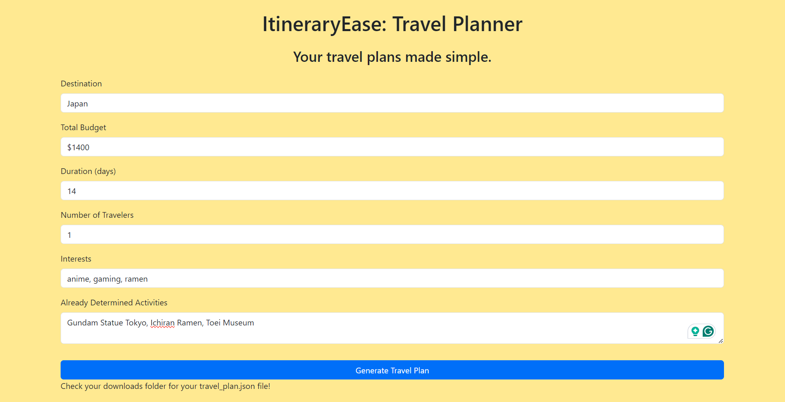
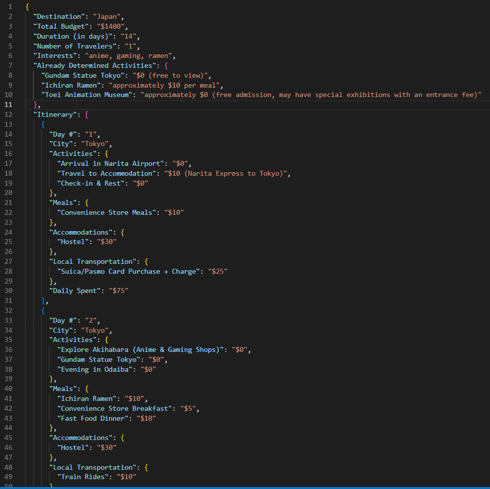
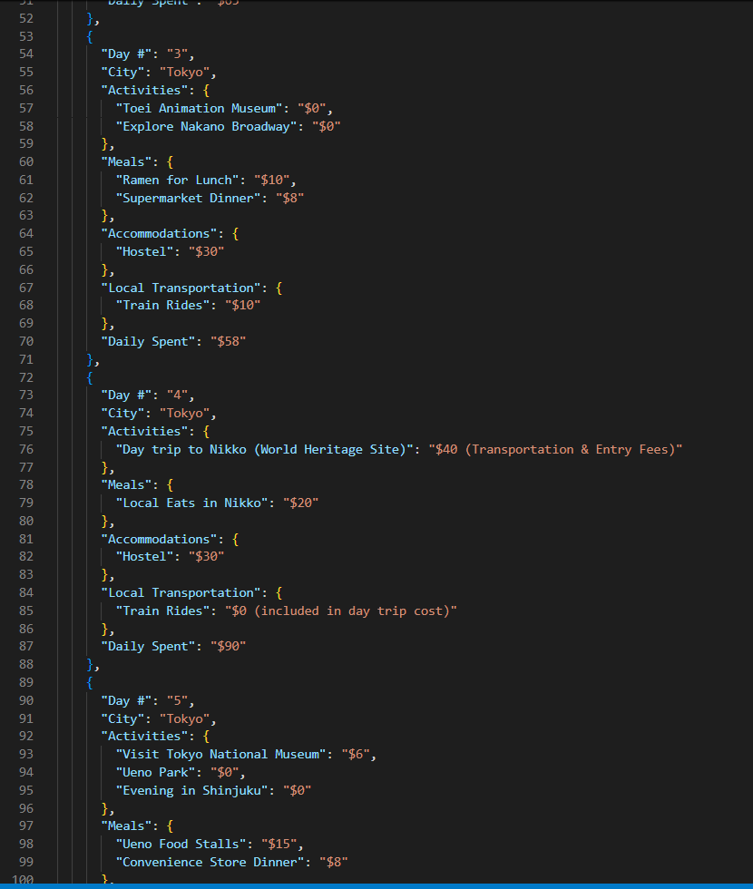

# CS4990-S24-ItineraryEase
ItineraryEase: Your travel plans made simple.

A travel planner that takes in user inputs, and recommends a detailed outline of what your next vacation will look like. Users fill out a form with info such as the destination, totalBudget, duration, numberOfTravelers, interests, alreadyDeterminedActivities and then they can generate a full itinerary based on their responses. This Itinerary will give you a rough idea of activities and things to do on your trip breaking it down day by day with estimated costs. The itinerary generation is Powered by my backend server that uses and calls the ChatGPT API in order to get a tailored response for all your traveling needs.

Example of User inputs for the Form:

Example of resulting travel plan output:

## Tech Stack
React.js front-end
Python flask back-end
Node.js cross platform runtime enviornment
Model: gpt-4-1106-preview (OpenAI completion model used to generate the custom travel plans)

## Available Scripts to run my app
npm install
npm start
